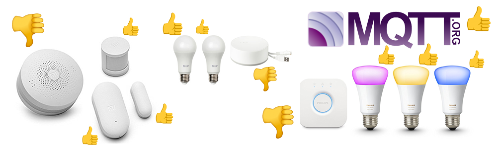

# zigbee2mqtt :bridge_at_night: :honeybee:

Allows you to use your Zigbee devices **without** the vendors (Xiaomi/TRADFRI/Hue) bridge or gateway.

It bridges events and allows you to control your Zigbee devices via MQTT. In this way you can integrate your Zigbee devices with whatever smart home infrastructure you are using. 

## [Getting started](https://github.com/Koenkk/zigbee2mqtt/wiki/Getting-started)
The [wiki](https://github.com/Koenkk/zigbee2mqtt/wiki) provides you all the information needed to get up and running! Make sure you don't skip sections if this is your first visit, as there might be important details in there for you.

[The documentation](https://github.com/Koenkk/zigbee2mqtt/wiki) will provide information on how to prepare, configure and start **zigbee2mqtt**, but also on how to customize the setup to fit your needs. 

If you aren't familiar with **zigbee** terminology make sure you [read this](https://github.com/Koenkk/zigbee2mqtt/wiki/ZigBee-network) to help you out.

## Integrations
Zigbee2mqtt integrates well with (almost) every home automation solution because it uses MQTT. However the following integrations are worth mentioning:

### [Home Assistant](https://www.home-assistant.io/)
- [Hassio](https://www.home-assistant.io/hassio/): Using [the official addon](https://github.com/danielwelch/hassio-zigbee2mqtt) from [danielwelch](https://github.com/danielwelch)
- Generic install or Hassbian: Using instructions [here](https://github.com/Koenkk/zigbee2mqtt/wiki/Integrating-with-Home-Assistant)

### [Domoticz](https://www.domoticz.com/)
- Integration implemented in [domoticz-zigbee2mqtt-plugin](https://github.com/stas-demydiuk/domoticz-zigbee2mqtt-plugin)

## Architecture 

## Supported devices
See [Supported devices](https://github.com/Koenkk/zigbee2mqtt/wiki/Supported-devices) to check whether your device is supported. There is quite an extensive list, including devices from vendors like Xiaomi, Ikea, Philips, OSRAM and more. 

If it's not listed in [Supported devices](https://github.com/Koenkk/zigbee2mqtt/wiki/Supported-devices), support can be added (fairly) easy, see [How to support new devices](https://github.com/Koenkk/zigbee2mqtt/wiki/How-to-support-new-devices).

## Support & help
If you need assistance you can check [opened issues](https://github.com/Koenkk/zigbee2mqtt/issues). Feel free to help with Pull Requests when you were able to fix things or add new devices or just share the love on social media. 

## Contributors
* [AndrewLinden](https://github.com/AndrewLinden)
* [oskarn97](https://github.com/oskarn97)
* [dgomes](https://github.com/dgomes)
* [Koenkk](https://github.com/Koenkk)
* [kirovilya](https://github.com/kirovilya)
* [ciotlosm](https://github.com/ciotlosm)
