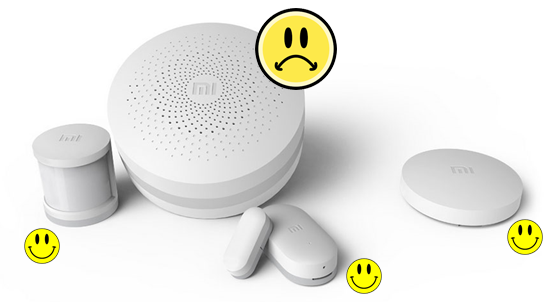

# zigbee2mqtt

Allows you to use your Zigbee devices **without** the vendors (Xiaomi/TRADFRI/Hue) bridge/gateway.

It bridges the events sent from the sensors and switches to MQTT. In this way you can integrate your Zigbee devices with whatever smart home infrastructure you are using.

The [wiki](https://github.com/Koenkk/zigbee2mqtt/wiki) provides you all the information needed to get up and running!

### Contributors
* [AndrewLinden](https://github.com/AndrewLinden)
* [oskarn97](https://github.com/oskarn97)
* [dgomes](https://github.com/dgomes)
* [Koenkk](https://github.com/Koenk)
