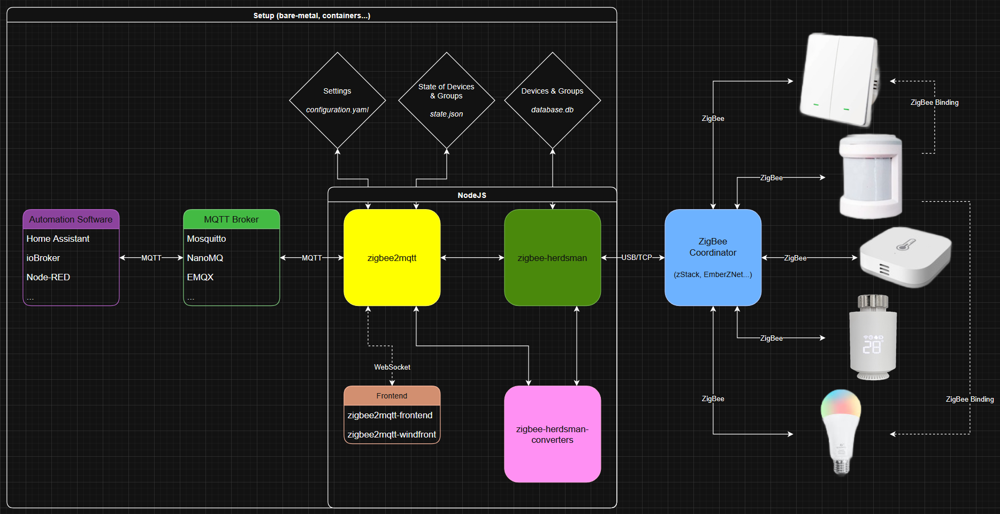

    
     
     
    

        
        
        
        
        
        
        
    

    <h1>Zigbee2MQTT  🌉 🐝</h1>
    

        Allows you to use your Zigbee devices <b>without</b> the vendor's bridge or gateway.
    

    

        It bridges events and allows you to control your Zigbee devices via MQTT. In this way you can integrate your Zigbee devices with whatever smart home infrastructure you are using.
    

## [Getting started](https://www.zigbee2mqtt.io/guide/getting-started)

The [documentation](https://www.zigbee2mqtt.io/) provides you all the information needed to get up and running! Make sure you don't skip sections if this is your first visit, as there might be important details in there for you.

If you aren't familiar with **Zigbee** terminology make sure you [read this](https://www.zigbee2mqtt.io/advanced/zigbee/01_zigbee_network.html) to help you out.

## [Integrations](https://www.zigbee2mqtt.io/guide/usage/integrations.html)

Zigbee2MQTT integrates well with (almost) every home automation solution because it uses MQTT. However the following integrations are worth mentioning:

### [Home Assistant](https://www.home-assistant.io/)

 

[Home Assistant OS](https://www.home-assistant.io/installation/) using [the official addon](https://github.com/zigbee2mqtt/hassio-zigbee2mqtt) ([other installations](https://www.zigbee2mqtt.io/guide/usage/integrations/home_assistant.html))

 

### [Homey](https://homey.app/)

 

Integration implemented in the [Homey App](https://homey.app/nl-nl/app/com.gruijter.zigbee2mqtt/) ([documentation & support](https://community.homey.app/t/83214))

 

### [Domoticz](https://www.domoticz.com/)

 

Integration implemented in Domoticz ([documentation](https://www.domoticz.com/wiki/Zigbee2MQTT)).

 

### [Gladys Assistant](https://gladysassistant.com/)

 

Integration implemented natively in Gladys Assistant ([documentation](https://gladysassistant.com/docs/integrations/zigbee2mqtt/)).

 

### [IoBroker](https://www.iobroker.net/)

 

Integration implemented in IoBroker ([documentation](https://github.com/o0shojo0o/ioBroker.zigbee2mqtt)).

 

## Architecture

### Internal Architecture

Zigbee2MQTT is made up of three modules, each developed in its own Github project. Starting from the hardware (adapter) and moving up; [zigbee-herdsman](https://github.com/koenkk/zigbee-herdsman) connects to your adapter to handle Zigbee communication and makes an API available to the higher levels of the stack. For e.g. Texas Instruments hardware, zigbee-herdsman uses the [TI zStack monitoring and test API](https://github.com/Koenkk/zigbee-herdsman/wiki/References#texas-instruments-zstack) to communicate with the adapter. The module [zigbee-herdsman-converters](https://github.com/koenkk/zigbee-herdsman-converters) handles the mapping from individual device models to the Zigbee clusters they support. [Zigbee clusters](https://github.com/Koenkk/zigbee-herdsman/wiki/References#csa-zigbee-alliance-spec) are the layers of the Zigbee protocol on top of the base protocol that define things like how lights, sensors and switches talk to each other over the Zigbee network. Finally, the Zigbee2MQTT module drives zigbee-herdsman and maps the zigbee messages to MQTT messages. Zigbee2MQTT also keeps track of the state of the system. It uses a `database.db` file to store this state; a text file with a JSON database of connected devices and their capabilities. Zigbee2MQTT provides several web-based interfaces ([zigbee2mqtt-frontend](https://github.com/nurikk/zigbee2mqtt-frontend), [zigbee2mqtt-windfront](https://github.com/Nerivec/zigbee2mqtt-windfront)) that allows monitoring and configuration.

### Developing

Zigbee2MQTT uses TypeScript. Therefore after making changes to files in the `lib/` directory you need to recompile Zigbee2MQTT. This can be done by executing `pnpm run build`. For faster development instead of running `pnpm run build` you can run `pnpm run build:watch` in another terminal session, this will recompile as you change files.

Before running any of the commands, you'll first need to run `pnpm install --include=dev`.
Before submitting changes run `pnpm run check:w` then `pnpm run test:coverage`.

## Supported devices

See [Supported devices](https://www.zigbee2mqtt.io/supported-devices) to check whether your device is supported. There is quite an extensive list, including devices from vendors like [Xiaomi](https://www.zigbee2mqtt.io/supported-devices/#v=Xiaomi), [Ikea](https://www.zigbee2mqtt.io/supported-devices/#v=IKEA), [Philips](https://www.zigbee2mqtt.io/supported-devices/#v=Philips), [OSRAM](https://www.zigbee2mqtt.io/supported-devices/#v=OSRAM) and more.

If it's not listed in [Supported devices](https://www.zigbee2mqtt.io/supported-devices), support can be added (fairly) easily, see [How to support new devices](https://www.zigbee2mqtt.io/advanced/support-new-devices/01_support_new_devices.html).

## Support & help

If you need assistance you can check [opened issues](https://github.com/Koenkk/zigbee2mqtt/issues). Feel free to help with Pull Requests when you were able to fix things or add new devices or just share the love on social media.
