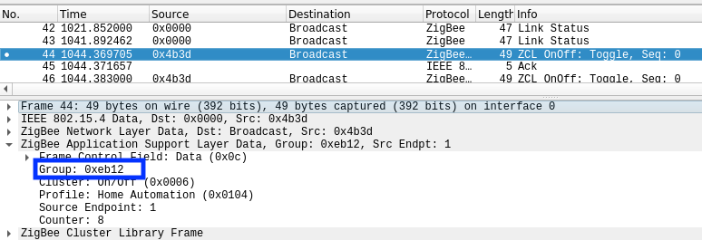

**IMPORTANT:** Before you start, make sure that `permit_join: true` is set in your `configuration.yaml`. Otherwise new devices cannot join the network!
It's equally important that `permit_join: false` is set in your `configuration.yaml` after initial setup is done to keep your Zigbee network safe and to avoid accidental joining of other Zigbee devices.

Start by checking if your Zigbee device is supported, see  [Supported devices](../information/supported_devices.md).

Once you see something similar to `New device with address 0x00159d00016da0c8 connected!` in the log your device is paired.

## Xiaomi
Different devices require different pairing methods. In case you get an `Error [ERR_UNHANDLED_ERROR]: Unhandled error. (Cannot get the Node Descriptor of the Device: 0x00158d0001720111)` you should try a different pairing method. See [Supported devices](../information/supported_devices.md) to figure out if your device is MiJia or Aqara.
* Most MiJia devices: press and hold the reset button on the device for +- 5 seconds (until the blue light starts blinking). **IMPORTANT**: Release and start pressing the reset button every second. This keeps the device awake, otherwise pairing will **fail!**.
* Most Aqara devices: press and hold reset button on the device for +- 5 seconds until the blue light blinks three times, release the reset button (the blue light will blink once more) and wait.
* Most Aqara wall switches: press and hold the button on the device for +- 10 seconds (until the blue light starts blinking and stops blinking), release and wait.
* [Video: Pairing Xiaomi Aqara Cube MFKZQ01LM](https://www.youtube.com/watch?v=uhMrcIAdGxg&feature=youtu.be)

*NOTE: When you fail to pair a device, try replacing the battery, this could solve the problem.*

## Belkin WeMo smart LED bulb
[Resetting or Restoring the Wemo® Smart LED Bulb, F7C033](http://www.belkin.com/us/support-article?articleNum=116178)

## IKEA TRADFRI
The factory reset procedure differs between TRADFRI components:

* Factory reset the light bulb ([video](https://www.youtube.com/watch?v=npxOrPxVfe0)). After resetting the bulb will automatically connect. While pairing, keep the bulb close the the CC2531 USB sniffer.
What works for me every time is using (very) short “on’s” and a little bit longer “off’s”…
I start with bulb on, then off, and then 6 “on’s”, where I kill the light as soon as the bulb shows signs of turning on… Hope that make sense…?

* To factory reset the TRADFRI wireless dimmer (ICTC-G-1) press the button 4 times (so the red lights starts blinking).

* To factory reset the TRADFRI control outlet, press and hold the reset button (pinhole underneath the light, located at the top of the outlet) with a paperclip until the white light starts fading. Hold onto the button for a few more seconds, then release. After this, the outlet will automatically connect.

* To factory reset the TRADFRI drivers (ICPSHC24-10EU-IL-1 and ICPSHC24-30EU-IL-1) use a small pin or paperclip to push the reset button once.

### IKEA TRADFRI remote control (E1524)
This device requires extra setup as it is meant to only control groups. Therefore it does not send any information directly to the coordinator. As the group ID is randomized upon factor reset we need to find out the group ID where it sends its commands to. This can be done by using Zigbee sniffing.

1. Pair the remote to Zigbee2mqtt by holding it close to the coordinator and pressing the button next to the battery 4 times. The red light on the remote will now flash a few times.
2. Setup your Zigbee traffic sniffer by following [How to sniff Zigbee traffic](../how_tos/how_to_sniff_zigbee_traffic.md).
3. Press the middle (power) button on the remote, this will produce the following message in Wireshark:

4. Retrieve the group from the message, which is `0xeb12` in the above example.
5. Add the group to the device in `configuration.yaml`, example:
```yaml
devices:
  '0x000b57fffecb472d':
    friendly_name: '0x000b57fffecb472d'
    retain: false
    coordinator_group: 0xeb12
```
6. Restart Zigbee2mqtt, when everything went OK you will see:
```
zigbee2mqtt:info 1/8/2019, 8:42:40 PM Sucesfully applied coordinator group for IKEA TRADFRI remote control (0x000b57fffecb472d)
```
### Why is this needed?
The TRADFRI remote sends the group ID using touchlink commissioning (while holding the reset button close to a bulb) but this is currently not supported by the firmware (Z-Stack 1.2 HA). Perhaps it will work in Z-Stack 3.0.

## Philips Hue
Factory reset the light bulb see [HOWTO: Factory reset a Hue bulb](https://www.youtube.com/watch?v=qvlEAELiJKs). After resetting the bulb will automatically connect.

* This is also possible with the [Tradfri Remote Control](https://www.ikea.com/us/en/images/products/tradfri-remote-control__0489469_PE623665_S4.JPG) by pressing and holding the reset button on the bottom of the remote (next to the battery). [This may not always work](https://github.com/Koenkk/zigbee2mqtt/issues/296#issuecomment-416923751).
* Philips Hue Lightstrip Plus V2 have been successfully reset using the [Hue Dimmer Switch](https://www2.meethue.com/en-us/support/dimmer-switch) by holding the On and Off buttons at the same time for 10 seconds while holding next to the Lightstrip controller, afterwards the Lightstrips can join Zigbee2MQTT.
* For the 7146060PH (Philips Hue Go), **the power cord has to be connected**, after the blinking light (**INSTEAD** of step four in the video), press and keep holding the button on the bottom until the device is paired (+- 60 seconds). While holding the button the Hue Go will give you a nice light show :smile:.

### Philips Living Colors IRIS (Friends of HUE)
Philips Living Colors IRIS comes with Philips (HUE) Remote Gen 3 (Round Click Wheel).
To Pair hold Hold ON and Bottom Left Key (Favorite 1) in Front of the LED until the Light Blinks and turns Orange. If connection was succesfull the Light will turn Green.

## Innr
Factory reset using [Innr manual reset instructions](https://www.youtube.com/watch?v=4zkpZSv84H4). After resetting the bulb will automatically connect.

## Hive
Follow instructions from [How do I reset my Hive Active Light?](https://www.hivehome.com/ca/support/Help_installing_Hive/HIH_Hive_Active_Light/How-do-I-reset-my-Hive-Active-Light). After resetting the bulb will automatically connect.

## OSRAM
### OSRAM Light Bulb
Follow instruction from [Manual reset](http://belkin.force.com/Articles/articles/en_US/Troubleshooting_and_Tutorials/Resetting-the-OSRAM-LIGHTIFY-Tunable-White-60-Bulb#a). After resetting the bulb will automatically connect.
### OSRAM Smart+ Plug
For the OSRAM Smart+ plug (AB3257001NJ) hold the on/off button until your hear a click (+- 10 seconds).
### OSRAM Smart+ Switch Mini
For the OSRAM Smart+ Switch Mini (AC0251100NJ) hold the Middle and Arrow Down Buttons for 10 Seconds to Reset the Device. Hold the Middle and Arrow Up Buttons for 3 Seconds to connect. If the Switch is connected hold Middle and Arrow Up Buttons for 3 Seconds to disconnect.
### OSRAM Switch 4x-LIGHTIFY
For the OSRAM Switch 4x-LIGHTIFY (AB371860055) hold the Bottom Left and Top Right Button for 3 Seconds to connect.

## PLUG EDP RE:DY
Factory reset the plug (hold the switch button for >10sec). After resetting the switch will automatically connect.

## Netvox power socket
Factory reset by:
- Press and hold the Binding Key for 15 seconds. The network indicator will flash green 3 times
(at the 3rd, the 10th, and the 15th second).
- After releasing the Binding Key, press the Switch Key within 2 seconds. The network indicator
will rapidly flash green.
- After fast flashes, Z809A will reboot, and the restore is completed. The socket will automatically connect now.

## Gledopto
Some of the Gledopto devices are not providing a `modelID`, in that case the modelID `undefined` is shown. Sometimes it helps to repair the device while keeping it close to the coordinator (less than one meter).

If this fails, the `modelID` has to be set manually in `data/database.db`. First find out the `modelID` of your devices from the [Supported devices page](../information/supported_devices.md). Then open `data/database.db` and add the `modelId` as highlighted in **bold** below.

*{"id":50,"type":"Router","ieeeAddr":"0x00124b0019c606cd","nwkAddr":10828,"manufId":0,"manufName":"GLEDOPTO","powerSource":"Mains (single phase)",**"modelId":"GL-S-007Z"**,"epList":[11,13],"status":"offline","joinTime":null,"endpoints":{"11":{"profId":49246,"epId":11,"devId":528,"inClusterList":[0,3,4,5,6,8,768],"outClusterList":[],"clusters":{"genBasic":{"dir":{"value":1},"attrs":{}},"genIdentify":{"dir":{"value":1},"attrs":{}},"genGroups":{"dir":{"value":1},"attrs":{}},"genScenes":{"dir":{"value":1},"attrs":{}},"genOnOff":{"dir":{"value":1},"attrs":{}},"genLevelCtrl":{"dir":{"value":1},"attrs":{}},"lightingColorCtrl":{"dir":{"value":1},"attrs":{}}}},"13":{"profId":49246,"epId":13,"devId":57694,"inClusterList":[4096],"outClusterList":[4096],"clusters":{"lightLink":{"dir":{"value":3},"attrs":{}}}}},"_id":"geCEMkRqlaMe6muE"}*
