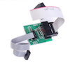
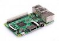

# What do I need?
In order to run zigbee2mqtt we need the following hardware:

| Name | Price | Picture |
| ------------- | ------------- | ------------- |
| CC debugger | +-10$ on AliExpress |  |
| CC2531 USB sniffer | +-8.50$ on AliExpress |  |
| Downloader cable CC2531 | +-2$ on AliExpress |  |
| [Supported Zigbee device(s)](https://github.com/Koenkk/zigbee2mqtt/wiki/Supported-devices) | - |  |
| PC or Raspberry Pi to run bridge | - |  |

# What's next?
[Flashing the CC2531 USB stick](flashing_the_cc2531.md)