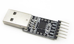

# How to connect a CC2530 coordinator using a USB to serial adapter

## Confirmed working
This how-to has been confirmed working with the following CC2530 based devices:

| Device| Image |
| --- | --- |
| **CC2530** |  |

and the following USB to serial adapters:

| Device| Image |
| --- | --- |
| **CP2102** |  |

## Flashing the firmware
The required coordinator fimrware can be found here: [CC sniffer devices](../information/cc_sniffer_devices.md).

## Connecting
Connect to CC2530 to the USB to serial adapter using the following mapping:

| USB-Serial Adaper  | CC2530  |
| :------------: |:---------------:|
| 3V3 | VCC |
| GND | GND |
| TXD | P02 |
| RXD | P03 |

Now plug in the USB-to-serial adapter in your USB port.

## Configuration
Add the following to your Zigbee2mqtt `configuration.yaml`:

```yaml
advanced:
  rtscts: false
```

and start Zigbee2mqtt, enjoy!