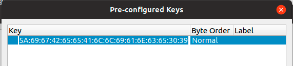
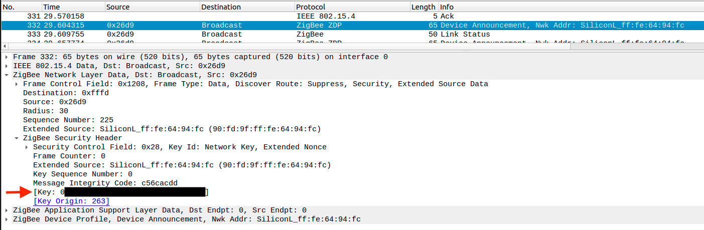

# How to sniff Zigbee traffic
Sniffing Zigbee traffic can be handy sometimes. E.g. when you want to analyze the commands used by a device.

## Prerequisites
* Ubuntu machine (tested with 18.10)
* CC2531 stick

## 1. Flashing the CC2531 stick
The CC2531 needs to be flashed with a sniffer firmware. This firmware is included with [PACKET-SNIFFER](http://www.ti.com/tool/PACKET-SNIFFER) (not **PACKET-SNIFFER-2!**). Download and install PACKET-SNIFFER. The firmware can then be found here: `C:\Program Files (x86)\Texas Instruments\SmartRF Tools\Packet Sniffer\bin\general\firmware\sniffer_fw_cc2531.hex`. Flash the firmware using the instructions from [Flashing the CC2531](../getting_started/flashing_the_cc2531.md).

## 2. Installing required tools
```bash
cd /opt
sudo apt-get install -y libusb-1.0-0-dev wireshark
curl -L https://github.com/homewsn/whsniff/archive/v1.1.tar.gz | tar zx
cd whsniff-1.1
make
sudo make install
```

## 3. Sniffing traffic
Start wireshark with `sudo whsniff -c ZIGBEE_CHANNEL_NUMBER | wireshark -k -i -`

Wireshark will start and log the Zigbee messages. As these messages are encrypted we need to add 2 encryption keys. The first one is the Trust Center link key, which is the same for (almost) every Zigbee network. The second on is the network encryption key.

Add the Trust Center link key by going to to Edit -> Preferences -> Protocols -> ZigBee. Set Security Level to *AES-128 Encryption, 32-bit Integrity Protection* and click on *Edit*. Click on *+* and add `5A:69:67:42:65:65:41:6C:6C:69:61:6E:63:65:30:39` with Byte Order Normal.

*NOTE: The Hue bridge uses a [different Trust Center link key](https://peeveeone.com/?p=166)*



Next we need to figure out the network encryption key. The network encryption key is exposed when a device joins the network. Pair a new device to the network (or repair an existing one) and grab the message where the Info is *Device Announcement....*. Open the message and expand *ZigBee Network Layer Data* -> *ZigBee Security Header*.



Copy the key value, as shown above and go to Edit -> Preferences -> Protocols -> ZigBee -> Edit and add the key with Byte Order Normal.

Now Wireshark is able to decrypt the messages. When e.g. turning on a light you will see a message similar to:


