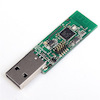
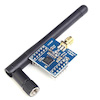
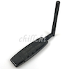

# CC sniffer devices

Zigbee2mqtt supports several CC2530 and CC2531 devices. Both can be used as a router or coordinator.
A discussion of these devices can be found [here](https://github.com/Koenkk/zigbee2mqtt/issues/52).
For more information about a coordinator and routers can be found [here](zigbee_network.md).

## How to flash
- [CC2530 based devices](http://ptvo.info/how-to-select-and-flash-cc2530-144/)
- [CC2531 based devices](../getting_started/flashing_the_cc2531.md)

## Supported devices

| Device| Description | Firmware | Example | Link |
| --- | --- | --- | --- | --- |
| **CC2531** | (_Default Option_). USB connected Zigbee sniffer based on CC2531 with PCB antenna and no RF frontend. A very cheap option but has limited range (~30m line of sight) | [Coordinator firmware](https://github.com/Koenkk/Z-Stack-firmware/tree/master/coordinator/CC2531/bin) <br/><br/> [Router firmware](https://github.com/Koenkk/Z-Stack-firmware/tree/master/router/CC2531/bin) |  | [Texas Instruments](http://www.ti.com/tool/cc2531emk)<br/><br/>[Aliexpress](http://www.aliexpress.com/w/wholesale-cc2531.html) | |
| **CC2530** | Serial connected Zigbee sniffer based on CC2530 with either PCB antenna OR external antenna, and no RF frontend. A very cheap option with potentially increased range with external antenna (~50-60m line of sight). More difficult to connect unless paired with serial-USB | [Coordinator firmware](https://github.com/Koenkk/Z-Stack-firmware/tree/master/coordinator/CC2530/bin) <br/><br/> [Router firmware](https://github.com/Koenkk/Z-Stack-firmware/tree/master/router/CC2530/bin) |  | [Aliexpress](http://www.aliexpress.com/wholesale?catId=0&initiative_id=SB_20181213104041&SearchText=cc2530) |
| **CC2530 + CC2591** | Serial connected Zigbee sniffer based on CC2530 with CC2591 RF frontend and external antenna. A more expensive option with increased range (~50-60m line of sight) and higher sensitivity. More difficult to connect unless paired with serial-USB |  [Coordinator firmware](https://github.com/Koenkk/Z-Stack-firmware/tree/master/coordinator/CC2530_CC2591/bin) <br/><br/> [Router firmware](https://github.com/Koenkk/Z-Stack-firmware/tree/master/router/CC2530_CC2591/bin) | | [Aliexpress](http://www.aliexpress.com/wholesale?catId=0&initiative_id=SB_20181213104521&SearchText=cc2530+cc2591) |
| **CC2530 with RFX2401** | Serial connected Zigbee sniffer based on CC2530 with RFX2401 RF frontend and external antenna. A more expensive option with increased range (~50-60m line of sight) and higher sensitivity. More difficult to connect unless paired with serial-USB (such as the example shown). **Note** that for the GBAN unit shown it is necessary to connect P04, P06 and P20 to GND - see [here](https://github.com/Koenkk/zigbee2mqtt/issues/52#issuecomment-391115143)| [Coordinator firmware (same as CC2530 + CC2591)](https://github.com/Koenkk/Z-Stack-firmware/tree/master/coordinator/CC2530_CC2591/bin) <br/><br/> [Router firmware (same as CC2530 + CC2591)](https://github.com/Koenkk/Z-Stack-firmware/tree/master/router/CC2530_CC2591/bin) |  | [GBAN](http://www.gban.cn/en/product_show.asp?id=43)<br/><br/>[Aliexpress](http://www.aliexpress.com/wholesale?catId=0&initiative_id=SB_20181213104722&SearchText=cc2530+rf) |


NOTE: When using a CC2530 based device the following configuration is necessary:

```yaml
advanced:
  rtscts: false
```
