# Supported devices

*NOTE: This file has been generated, do not edit this file manually!*

Currently **137** devices are supported from **29** different vendors.

In case you own a Zigbee device which is **NOT** listed here, please see
[How to support new devices](https://github.com/Koenkk/zigbee2mqtt/wiki/How-to-support-new-devices).

### Belkin

| Model | Description | Picture |
| ------------- | ------------- | -------------------------- |
| F7C033 | Belkin WeMo smart LED bulb (on/off, brightness) | 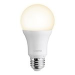 |

### Bitron Home

| Model | Description | Picture |
| ------------- | ------------- | -------------------------- |
| AV2010/22 | Bitron Home Wireless motion detector (occupancy) | 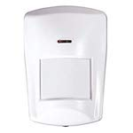 |

### Centralite

| Model | Description | Picture |
| ------------- | ------------- | -------------------------- |
| 4256251-RZHAC | Centralite White Swiss power outlet switch with power meter (switch and power meter) | 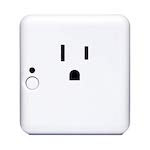 |

### Climax

| Model | Description | Picture |
| ------------- | ------------- | -------------------------- |
| PSS-23ZBS | Climax Power plug (on/off) | 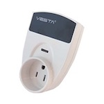 |

### Commercial Electric

| Model | Description | Picture |
| ------------- | ------------- | -------------------------- |
| 53170161 | Commercial Electric Matte White Recessed Retrofit Smart Led Downlight - 4 Inch (on/off, brightness, color temperature) | 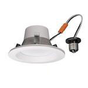 |

### Custom devices (DiY)

| Model | Description | Picture |
| ------------- | ------------- | -------------------------- |
| CC2530.ROUTER | Custom devices (DiY) [CC2530 router](http://ptvo.info/cc2530-based-zigbee-coordinator-and-router-112/) (state, description, type, rssi) | 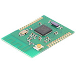 |
| DNCKATSW001 | Custom devices (DiY) [DNCKAT single key wired wall light switch](https://github.com/dzungpv/dnckatsw00x/) (on/off) |  |
| DNCKATSW002 | Custom devices (DiY) [DNCKAT double key wired wall light switch](https://github.com/dzungpv/dnckatsw00x/) (hold/release, on/off) | 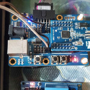 |
| DNCKATSW003 | Custom devices (DiY) [DNCKAT triple key wired wall light switch](https://github.com/dzungpv/dnckatsw00x/) (hold/release, on/off) |  |
| DNCKATSW004 | Custom devices (DiY) [DNCKAT quadruple key wired wall light switch](https://github.com/dzungpv/dnckatsw00x/) (hold/release, on/off) |  |

### Dresden Elektronik

| Model | Description | Picture |
| ------------- | ------------- | -------------------------- |
| Mega23M12 | Dresden Elektronik ZigBee Light Link wireless electronic ballast (on/off, brightness, color temperature, color xy) | 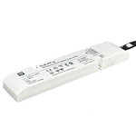 |

### EDP

| Model | Description | Picture |
| ------------- | ------------- | -------------------------- |
| PLUG EDP RE:DY | EDP re:dy plug (on/off, power measurement) | 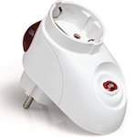 |

### GE

| Model | Description | Picture |
| ------------- | ------------- | -------------------------- |
| 22670 | GE Link smart LED light bulb, BR30 soft white (2700K) (on/off, brightness) | 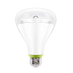 |
| 45852GE | GE ZigBee plug-in smart dimmer (on/off, brightness) | 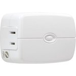 |
| 45857GE | GE ZigBee in-wall smart dimmer (on/off, brightness) | 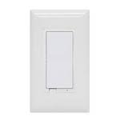 |

### Gledopto

| Model | Description | Picture |
| ------------- | ------------- | -------------------------- |
| GL-C-008 | Gledopto Zigbee LED controller RGB + CCT / RGBW / WWCW / Dimmer (on/off, brightness, color temperature, color xy) | 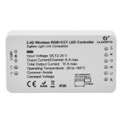 |

### HEIMAN

| Model | Description | Picture |
| ------------- | ------------- | -------------------------- |
| HS1SA | HEIMAN Smoke detector (smoke) | 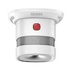 |

### Hive

| Model | Description | Picture |
| ------------- | ------------- | -------------------------- |
| HALIGHTDIMWWE27 | Hive Active light dimmable (on/off, brightness) | 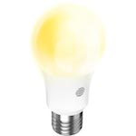 |

### IKEA

| Model | Description | Picture |
| ------------- | ------------- | -------------------------- |
| LED1545G12 | IKEA TRADFRI LED bulb E26/E27 980 lumen, dimmable, white spectrum, opal white (on/off, brightness, color temperature) | 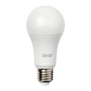 |
| LED1546G12 | IKEA TRADFRI LED bulb E26/E27 950 lumen, dimmable, white spectrum, clear (on/off, brightness, color temperature) | 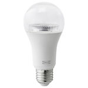 |
| LED1623G12 | IKEA TRADFRI LED bulb E27 1000 lumen, dimmable, opal white (on/off, brightness) |  |
| LED1537R6 | IKEA TRADFRI LED bulb GU10 400 lumen, dimmable, white spectrum (on/off, brightness, color temperature) | 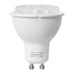 |
| LED1650R5 | IKEA TRADFRI LED bulb GU10 400 lumen, dimmable (on/off, brightness) | 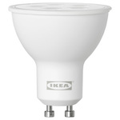 |
| LED1536G5 | IKEA TRADFRI LED bulb E12/E14 400 lumen, dimmable, white spectrum, opal white (on/off, brightness, color temperature) |  |
| LED1622G12 | IKEA TRADFRI LED bulb E26 1000 lumen, dimmable, opal white (on/off, brightness) | 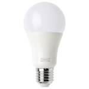 |
| LED1624G9 | IKEA TRADFRI LED bulb E27/E26 600 lumen, dimmable, color, opal white (on/off, brightness, color temperature, color xy) | 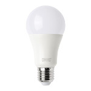 |
| LED1649C5 | IKEA TRADFRI LED bulb E12/E14/E17 400 lumen, dimmable warm white, chandelier opal (on/off, brightness) | 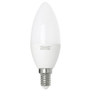 |
| ICTC-G-1 | IKEA TRADFRI wireless dimmer (brightness [0-255], quick rotate for instant 0/255) | 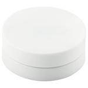 |
| ICPSHC24-10EU-IL-1 | IKEA TRADFRI driver for wireless control (10 watt) (on/off, brightness) | 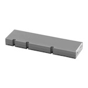 |
| ICPSHC24-30EU-IL-1 | IKEA TRADFRI driver for wireless control (30 watt) (on/off, brightness) | 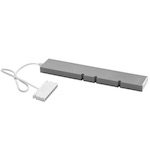 |
| L1527 | IKEA FLOALT LED light panel, dimmable, white spectrum (30x30 cm) (on/off, brightness, color temperature) | 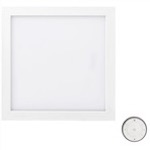 |
| L1529 | IKEA FLOALT LED light panel, dimmable, white spectrum (60x60 cm) (on/off, brightness, color temperature) | 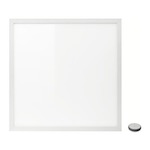 |
| L1528 | IKEA FLOALT LED light panel, dimmable, white spectrum (30x90 cm) (on/off, brightness, color temperature) |  |
| E1603 | IKEA TRADFRI control outlet (on/off) |  |

### Innr

| Model | Description | Picture |
| ------------- | ------------- | -------------------------- |
| RB 185 C | Innr E27 Bulb RGBW (on/off, brightness, color temperature, color xy) | 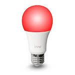 |
| RB 285 C | Innr E27 Bulb RGBW (on/off, brightness, color temperature, color xy) | 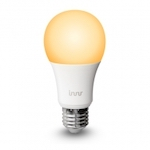 |
| RB 165 | Innr E27 Bulb (on/off, brightness) | 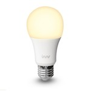 |
| RB 175 W | Innr E27 Bulb warm dimming (on/off, brightness) | 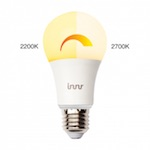 |
| RS 125 | Innr GU10 Spot (on/off, brightness) | 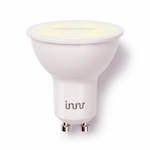 |
| RS 128 T | Innr GU10 Spot 350 lm, dimmable, white spectrum (on/off, brightness, color temperature) | 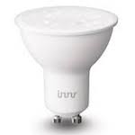 |
| RB 145 | Innr E14 Candle (on/off, brightness) | 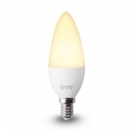 |
| BY 165 | Innr B22 Bulb dimmable (on/off, brightness) | 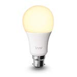 |
| PL 110 | Innr Puck Light (on/off, brightness) |  |
| ST 110 | Innr Strip Light (on/off, brightness) | 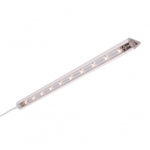 |
| UC 110 | Innr Under Cabinet Light (on/off, brightness) | 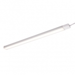 |
| DL 110 N | Innr Spot narrow (on/off, brightness) | 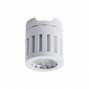 |
| DL 110 W | Innr Spot wide (on/off, brightness) |  |
| SL 110 N | Innr Spot Flex narrow (on/off, brightness) |  |
| SL 110 M | Innr Spot Flex medium (on/off, brightness) |  |
| SL 110 W | Innr Spot Flex wide (on/off, brightness) | 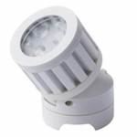 |

### Iris

| Model | Description | Picture |
| ------------- | ------------- | -------------------------- |
| 3210-L | Iris Smart plug (on/off) |  |
| 3326-L | Iris Motion sensor (occupancy and temperature) | 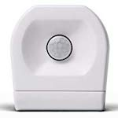 |
| 3320-L | Iris Contact sensor (contact) |  |

### JIAWEN

| Model | Description | Picture |
| ------------- | ------------- | -------------------------- |
| K2RGBW01 | JIAWEN Wireless Bulb E27 9W RGBW (on/off, brightness, color temperature, color xy) | 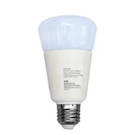 |

### Ksentry Electronics

| Model | Description | Picture |
| ------------- | ------------- | -------------------------- |
| KS-SM001 | Ksentry Electronics [Zigbee OnOff Controller](http://ksentry.manufacturer.globalsources.com/si/6008837134660/pdtl/ZigBee-module/1162731630/zigbee-on-off-controller-modules.htm) (on/off) | 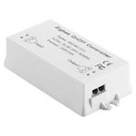 |

### Nanoleaf

| Model | Description | Picture |
| ------------- | ------------- | -------------------------- |
| NL08-0800 | Nanoleaf Smart Ivy Bulb E27 (on/off, brightness) | 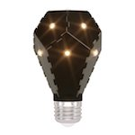 |

### Netvox

| Model | Description | Picture |
| ------------- | ------------- | -------------------------- |
| Z809A | Netvox Power socket with power consumption monitoring (on/off, power measurement) | 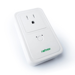 |

### Nue

| Model | Description | Picture |
| ------------- | ------------- | -------------------------- |
| FB56+ZSW05HG1.2 | Nue ZigBee one gang smart switch (on/off) | 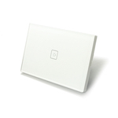 |
| MG-AUWS01 | Nue ZigBee Double GPO (on/off) | 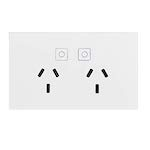 |

### OSRAM

| Model | Description | Picture |
| ------------- | ------------- | -------------------------- |
| 4058075816718 | OSRAM SMART+ outdoor wall lantern RGBW (on/off, brightness, color temperature, color xy) | 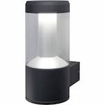 |
| AA69697 | OSRAM Classic A60 RGBW (on/off, brightness, color temperature, color xy) | 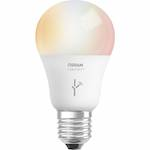 |
| AC03645 | OSRAM LIGHTIFY LED CLA60 E27 RGBW (on/off, brightness, color temperature, color xy) | 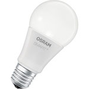 |
| AC03642 | OSRAM SMART+ CLASSIC A 60 TW (on/off, brightness, color temperature) | 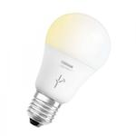 |
| AA70155 | OSRAM LIGHTIFY LED A19 tunable white / Classic A60 TW (on/off, brightness, color temperature) |  |
| AA68199 | OSRAM LIGHTIFY LED PAR16 50 GU10 tunable white (on/off, brightness, color temperature) |  |
| AB32840 | OSRAM LIGHTIFY LED Classic B40 tunable white (on/off, brightness, color temperature) |  |
| 4058075816794 | OSRAM Smart+ Ceiling TW (on/off, brightness, color temperature) |  |
| AC03641 | OSRAM LIGHTIFY LED Classic A60 clear (on/off, brightness) |  |
| 4052899926158 | OSRAM LIGHTIFY Surface Light TW (on/off, brightness) |  |
| AB401130055 | OSRAM LIGHTIFY Surface Light LED Tunable White (on/off, brightness, color temperature) |  |
| AB3257001NJ | OSRAM Smart+ plug (on/off) |  |
| 4052899926110 | OSRAM Flex RGBW (on/off, brightness, color temperature, color xy) |  |
| 4058075036185 | OSRAM Outdoor Flex RGBW (on/off, brightness, color temperature, color xy) |  |
| 4058075036147 | OSRAM Smart+ Gardenpole RGBW (on/off, brightness, color temperature, color xy) |  |
| AB35996 | OSRAM Smart+ Spot GU10 Multicolor (on/off, brightness, color temperature, color xy) |  |
| AC08562 | OSRAM SMART+ Candle E14 Dimmable White (on/off, brightness) |  |
| AC01353010G | OSRAM SMART+ Motion Sensor (occupancy and temperature) |  |

### Paulmann

| Model | Description | Picture |
| ------------- | ------------- | -------------------------- |
| 50045 | Paulmann SmartHome Zigbee LED-stripe (on/off, brightness) |  |
| 50049 | Paulmann SmartHome Yourled RGB Controller (on/off, brightness, color xy) |  |

### Philips

| Model | Description | Picture |
| ------------- | ------------- | -------------------------- |
| 7299760PH | Philips Hue Bloom (on/off, brightness, color xy) |  |
| 7146060PH | Philips Hue Go (on/off, brightness, color temperature, color xy) |  |
| 433714 | Philips Hue Lux A19 bulb E27 (on/off, brightness) |  |
| 9290011370 | Philips Hue white A60 bulb E27 (on/off, brightness) |  |
| 8718696449691 | Philips Hue White Single bulb B22 (on/off, brightness) |  |
| 7299355PH | Philips Hue white and color ambiance LightStrip (on/off, brightness, color xy) |  |
| 915005106701 | Philips Hue white and color ambiance LightStrip plus (on/off, brightness, color temperature, color xy) |  |
| 9290012573A | Philips Hue white and color ambiance E26/E27/E14 (on/off, brightness, color temperature, color xy) |  |
| 9290002579A | Philips Hue white and color ambiance BR30 (on/off, brightness, color temperature, color xy) |  |
| 8718696485880 | Philips Hue white and color ambiance GU10 (on/off, brightness, color temperature, color xy) |  |
| 915005733701 | Philips Hue White and color ambiance Play Lightbar (on/off, brightness, color temperature, color xy) |  |
| 8718696695203 | Philips Hue white ambiance E14 (on/off, brightness, color temperature) |  |
| 8718696598283 | Philips Hue white ambiance GU10 (on/off, brightness, color temperature) |  |
| 8718696548738 | Philips Hue white ambiance E26/E27 (on/off, brightness, color temperature) |  |
| 3261030P7 | Philips Hue Being (on/off, brightness, color temperature) |  |
| 3216331P5 | Philips Philips Hue White ambiance Aurelle Rectangle Panel Light (on/off, brightness, color temperature) |  |
| 7199960PH | Philips Hue Iris (on/off, brightness, color xy) |  |
| 324131092621 | Philips Hue dimmer switch (on/off) |  |
| 9290012607 | Philips Hue motion sensor (occupancy, temperature, illuminance) |  |

### Sengled

| Model | Description | Picture |
| ------------- | ------------- | -------------------------- |
| E11-G13 | Sengled Element Classic (A19) (on/off, brightness) |  |
| E11-G23/E11-G33 | Sengled Element Classic (A60) (on/off, brightness) |  |
| Z01-CIA19NAE26 | Sengled Element Touch (A19) (on/off, brightness) |  |
| Z01-A19NAE26 | Sengled Element Plus (A19) (on/off, brightness, color temperature) |  |
| E11-N1EA | Sengled Element Plus Color (A19) (on/off, brightness, color temperature, color xy) |  |

### SmartThings

| Model | Description | Picture |
| ------------- | ------------- | -------------------------- |
| STSS-MULT-001 | SmartThings SmartSense multi sensor (contact) |  |
| STS-PRS-251 | SmartThings SmartThings arrival sensor (presence) |  |

### Sylvania

| Model | Description | Picture |
| ------------- | ------------- | -------------------------- |
| 73742 | Sylvania LIGHTIFY LED adjustable white RT 5/6 (on/off, brightness, color temperature) |  |
| 73740 | Sylvania LIGHTIFY LED adjustable white BR30 (on/off, brightness, color temperature) |  |
| 73693 | Sylvania LIGHTIFY LED RGBW A19 (on/off, brightness, color temperature, color xy) |  |
| 74283 | Sylvania LIGHTIFY LED soft white dimmable A19 (on/off, brightness) |  |
| 74696 | Sylvania LIGHTIFY LED soft white dimmable A19 (on/off, brightness) |  |
| 72922-A | Sylvania SMART+ Smart Plug (on/off) |  |
| 74282 | Sylvania Smart Home adjustable white MR16 LED bulb (on/off, brightness, color temperature) |  |

### Trust

| Model | Description | Picture |
| ------------- | ------------- | -------------------------- |
| ZLED-2709 | Trust Smart Dimmable LED Bulb (on/off, brightness) |  |

### Xiaomi

| Model | Description | Picture |
| ------------- | ------------- | -------------------------- |
| WXKG01LM | Xiaomi MiJia wireless switch (single, double, triple, quadruple, many, long, long_release click) |  |
| WXKG11LM | Xiaomi Aqara wireless switch (single, double click (and triple, quadruple, hold, release depending on model)) |  |
| WXKG12LM | Xiaomi Aqara wireless switch (with gyroscope) (single, double, shake, hold, release) |  |
| WXKG03LM | Xiaomi Aqara single key wireless wall switch (single click) |  |
| WXKG02LM | Xiaomi Aqara double key wireless wall switch (left, right and both click) |  |
| QBKG04LM | Xiaomi Aqara single key wired wall switch (on/off) |  |
| QBKG11LM | Xiaomi Aqara single key wired wall switch (on/off, power measurement) |  |
| QBKG03LM | Xiaomi Aqara double key wired wall switch (release/hold, on/off) |  |
| QBKG12LM | Xiaomi Aqara double key wired wall switch (on/off, power measurement) |  |
| WSDCGQ01LM | Xiaomi MiJia temperature & humidity sensor  (temperature and humidity) |  |
| WSDCGQ11LM | Xiaomi Aqara temperature, humidity and pressure sensor (temperature, humidity and pressure) |  |
| RTCGQ01LM | Xiaomi MiJia human body movement sensor (occupancy) |  |
| RTCGQ11LM | Xiaomi Aqara human body movement and illuminance sensor (occupancy and illuminance) |  |
| MCCGQ01LM | Xiaomi MiJia door & window contact sensor (contact) |  |
| MCCGQ11LM | Xiaomi Aqara door & window contact sensor (contact) |  |
| SJCGQ11LM | Xiaomi Aqara water leak sensor (water leak true/false) |  |
| MFKZQ01LM | Xiaomi Mi/Aqara smart home cube (shake, wakeup, fall, tap, slide, flip180, flip90, rotate_left and rotate_right) |  |
| ZNCZ02LM | Xiaomi Mi power plug ZigBee (on/off, power measurement) |  |
| QBCZ11LM | Xiaomi Aqara socket Zigbee (on/off, power measurement) |  |
| JTYJ-GD-01LM/BW | Xiaomi MiJia Honeywell smoke detector (smoke) |  |
| JTQJ-BF-01LM/BW | Xiaomi MiJia gas leak detector  (gas) |  |
| A6121 | Xiaomi Vima Smart Lock (inserted, forgotten, key error) |  |
| DJT11LM | Xiaomi Aqara vibration sensor (drop, tilt and touch) |  |

### ilux

| Model | Description | Picture |
| ------------- | ------------- | -------------------------- |
| 900008-WW | ilux Dimmable A60 E27 LED Bulb (on/off, brightness) |  |

